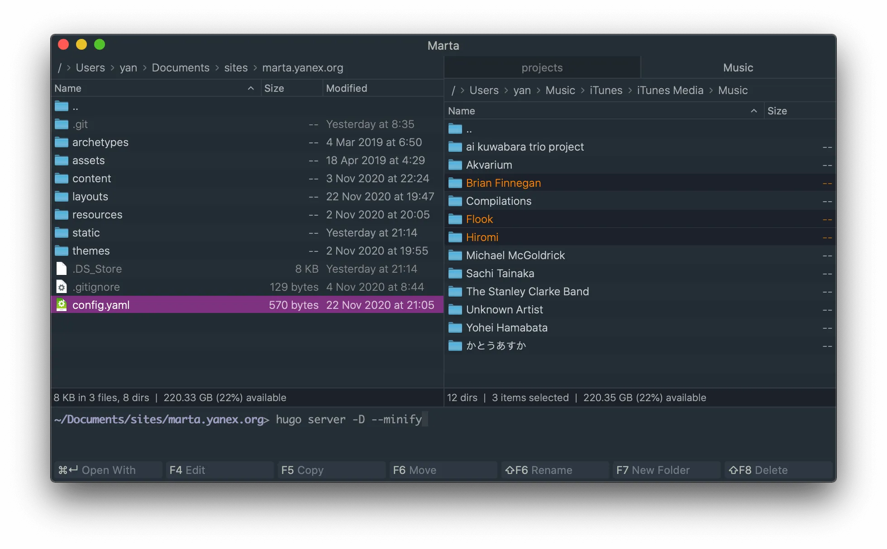

## The Fuck

[**The Fuck**](https://github.com/nvbn/thefuck) is a magnificent open-source app that corrects errors in previous console commands.

Example:

```bash
➜ apt-get install vim
E: Could not open lock file /var/lib/dpkg/lock - open (13: Permission denied)
E: Unable to lock the administration directory (/var/lib/dpkg/), are you root?

➜ fuck
sudo apt-get install vim [enter/↑/↓/ctrl+c]
[sudo] password for nvbn:
Reading package lists... Done
...
```


## Transfer.sh

[**transfer.sh**](https://transfer.sh) is a free service for sharing files right from the command line. It lets you encrypt files,
scan them for malware, upload several files at once, limit downloads or set the number of days before deletion.

Other useful examples of usage can be found [here](https://github.com/dutchcoders/transfer.sh/blob/master/examples.md).

```bash
# Upload with curl
$ curl --upload-file ./hello.txt https://transfer.sh/hello.txt  
# And get a link in response

# Other options
$ curl -H "Max-Downloads: 1" -H "Max-Days: 5" --upload-file ./hello.txt https://transfer.sh/hello.txt

# Download the file
$ curl https://transfer.sh/66nb8/hello.txt -o hello.txt
```
