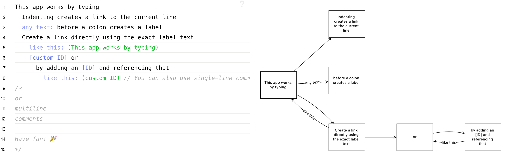

## Calculations

### [Soulver](https://soulver.app/)
A powerful but simple notepad calculator app for macOS. It supports units, dates, currency and time zones conversions, variables and lines referencing what makes it easier than spreadsheets.

### [Numi](https://numi.app/)
A Soulver alternative with a similar set of features. Works completely the same way: just type a string of what you need and get the result.

```
$30 in Euro
2:30 pm HKT in Berlin
```

### [Numbr](https://numbr.dev/)
Fewer features but works right in a browser.

## Flowchart
[**Flowchart**](https://flowchart.fun/) is a web app that lets you easily create flow charts just via typing. Every single line of text is a node, indentation makes a child node. It's also possible to add labels and link nodes. A chart can be exported to several formats.



## Teuxdeux
[**Teuxdeux**](https://teuxdeux.com/) is a beautifully simple but still powerful way to keep track of the little things. The app is as simple as a piece of paper. Automatically synced to the cloud, TeuxDeux to-dos are backed up, secure, and available wherever you are. Some of the features:

* markdown
* recurring to-dos
* voice-to-text
* calendar date picker
* drag to-dos to tomorrow
* custom colors
powerful to-do editing

Available on iOS, Android and as a web app.

## Wox
[**Wox**](http://www.wox.one/) is a free and open-sourced launcher for Windows. With an `Alt` + `Space` keyboard shortcut you can search for apps, files, folders and any queries on the internet. Usage examples can be found on Github [page](https://github.com/Wox-launcher/Wox).